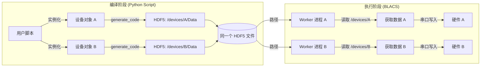
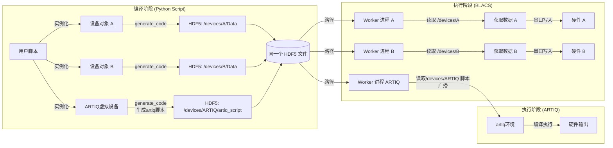
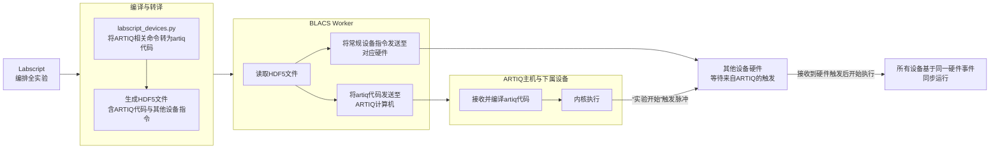
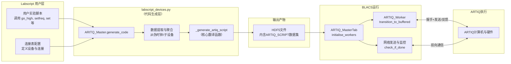
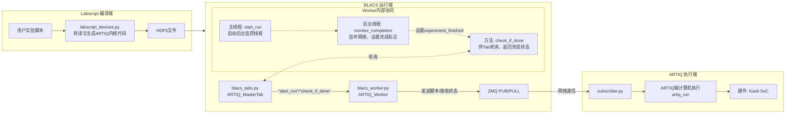

### 构造思路

现有的Labscript控制硬件流程：实验脚本中调用labscript_device.py中函数，将命令写入HDF5文件；Labscript执行文件时，blacs_worker.py读取HDF5文件中命令，转化为二进制命令通过串口发送给硬件；通过GUI输入是，直接由Worker将命令发送给硬件

~~~mermaid
graph LR
    subgraph "Labscript编译<br>(labscript_devices.py)"
    A[用户脚本<br>add_dds_command] --> B[sequence_commands<br>列表]
    B --> C[generate_code]
    C --> D[HDF5文件<br>SEQUENCE_COMMANDS]
    end
    
    style D fill:#e1f5e1,stroke:#2e7d32,stroke-width:2px
    style D stroke-dasharray: 5 5
    
    D --> E[transition_to_buffered]
    
    subgraph "BLACS工作进程<br>(blacs_workers.py)"
    E --> F[读取HDF5数据]
    F --> G["gen_binary_cmd_data<br>(协议封装)"]
    G --> H["Serial Write<br>(串口发送)"]
    end
    
    style H fill:#e3f2fd,stroke:#1565c0,stroke-width:2px
    
    H --> M[FPGA硬件]
    
    subgraph "BLACS界面<br>(blacs_tabs.py)"
    I[用户界面输入参数] --> J[点击<br>Send Command]
    J --> K[queue_work<br>'set_command']
    K --> L[Worker接收任务]
    L --> G
    end
    
    style I fill:#fce4ec,stroke:#ad1457,stroke-width:2px
    
    %% 添加更多垂直间距
    classDef subgraphLabel fill:#fff,stroke:#333,stroke-width:1px
~~~

若控制多个硬件设备，则将脚本中命令编译进同一个HDF5文件后，分不同Worker分别调用blacs_worker.py读取命令并发送给硬件执行




问题：ARTIQ本身也是类似Labscript的控制系统，需要将一次实验内所有命令写入一个脚本，在artiq环境中提交执行；无法像普通设备一样，直接通过串口即时输入命令执行

思路：

- 在Labscript层面生成一个对应ARTIQ的虚拟设备，相应的命令直接编译为artiq脚本，写入HDF5文件
- 执行阶段，读取HDF5文件中的artiq脚本，通过网络（特定IP的广播和接收）发送到运行ARTIQ的设备和环境中，自动执行
- 通过GUI的控制思路类似，根据控件的命令生成artiq脚本，自动发送并提交执行





可能遇到的问题：

- 难以实时显示ARTIQ输出情况——暂时不用考虑
- ARTIQ下有多个输出通道，可能在写入以及编译artiq脚本过程中造成困难——在生成虚拟设备时候注意类的定义，具体情况再处理——解决，挂在outputs属性下
- 需要反馈ARTIQ执行情况（异常要报错，正常要显示）——解决，可以在BLACS显示ARTIQ端输出

---


### 程序实现

- labscript_device.py 定义Pseudoclock：ARTIQ_Master
  - 定义属性outputs，ARTIQ的子输出通道挂在outputs下（即`parent_device=ARTIQ_Master_name.outputs`）
  - `generate_code`：将有关ARTIQ的命令转译为artiq脚本，规则可以参考ARTIQ使用说明中控制程序部分
    - 时间游标t：对应artiq中`at_mu`；artiq脚本默认在实验开始前延迟1ms
    - TTL：对应 `DigitalOut`，`connection` 属性为 `ttlX`
    - DAC：对应 `AnalogOut`， `connection` 属性为 `channel0`，`fastino0_channelX`，`dac0`等，只看末位数字，代表通道索引
    - DDS：需要使用`ARTIQ_DDS`， `connection` 属性为 `urukul0_chX`；兼容原Labscript的`setfreq`、`setamp`、`setphase`写法，同时新增`set`和`set_att`

- blacs_worker.py + blacs_tab.py
  - blacs_worker.py中的 `start_run` 和 `check_if_done` ，以及blacs_tab.py中的 `start_run` 和 `wait_until_done` 表示主时钟启动（Labscript内部逻辑）并检查实验是否完成；这里通过subscriber端反馈的消息确定实验是否完成
  - `transition_to_buffered` 函数实现与subscriber通信功能：先双向握手检查subscriber是否在线、正常工作且空闲，再发送artiq脚本
  - BLACS窗口会显示subscriber侧运行的结果以及相关信息，如是否正常握手、是否完成发送和接受、是否完成实验以及可能的报错信息等
  - 通过GUI的手动操控目前无法实现（实际上对于ARTIQ这样一个“庞然大物”，也意义不大……老老实实提交脚本吧）

- subscriber.py
  - 需要配置device_db.py文件（可能还需要其他的），因此最好需要在 artiq_master 文件夹下运行（全都配好了）
  - subscriber可以显示绝大部分artiq运行时输出的信息，并发回BLACS，因此一般不需要再调用artiq的GUI或其他
  - 在subscriber空闲时，可以输入q+Enter或Esc退出subscriber





---


### 使用说明

#### 接收方 subscriber

对 ARTIQ 的控制是由 labscript 侧编译好 artiq 脚本发送到接收方（连接控制 ARTIQ 的计算机），在 artiq 环境下执行；因此需要对接双方通信 IP，并在接收方运行接收程序 subscriber.py

subscriber.py 程序接收到 artiq 脚本后，会直接在当前路径下运行；因此需要以下条件

- subscriber.py 程序和 labscript 侧均正确选择广播、反馈的 IP 和端口

- 进入安装了 `artiq` 包的环境（YaziMaster 和 Yazi02 为 `artiq` 环境）

- 路径下存在正确的 device_db.py 文件

最好在完成全部配置、可以运行 `artiq_session` 命令的 artiq_master 文件夹下运行

简而言之，在 artiq_master 文件夹下，启动命令行窗口后运行：

```cmd
conda activate artiq
python .\subscriber.py
```


#### 连接表 connection_table

在 labscript 的连接表 connection_table.py 中添加 ARTIQ 设备，需参考以下规范：

```python
# labscript 运行的脚本中不能出现中文注释，以下注释仅作说明

from labscript import AnalogOut, DigitalOut
from user_devices.ARTIQ.labscript_devices import ARTIQ_DDS, ARTIQ_Master

ARTIQ_MASTER_IP = '127.0.0.1'	# 控制 ARTIQ 计算机的 IP（发送方），这里是直接发送到同一台电脑时的设置
ARTIQ_BROADCAST_PORT = 5555		# 广播端口
ARTIQ_FEEDBACK_PORT = 5556		# 接收反馈消息的端口

# 主时钟 ARTIQ
ARTIQ = ARTIQ_Master(
    name='ARTIQ',
    artiq_ip=ARTIQ_MASTER_IP,
    broadcast_port=ARTIQ_BROADCAST_PORT,
    feedback_port=ARTIQ_FEEDBACK_PORT,
)

# ARTIQ 下的各个输出通道需要分别实例化
# parent_device=ARTIQ_name.outputs，其中 ARTIQ_name 是上面设置的 ARTIQ 的 name 属性

# TTL 通道采用 DigitalOut 类，connection=ttlX，X=0~39
ttl0 = DigitalOut(name='ttl0', parent_device=ARTIQ.outputs, connection='ttl0')
ttl1 = DigitalOut(name='ttl1', parent_device=ARTIQ.outputs, connection='ttl1')

# DAC 通道采用 AnalogOut 类，connection 只识别最后一个数字X，X=0~31
dac0 = AnalogOut(name='dac0', parent_device=ARTIQ.outputs, connection='fastino0_channel0')
dac1 = AnalogOut(name='dac1', parent_device=ARTIQ.outputs, connection='fastino0_channel1')

# DDS 通道采用 ARTIQ_DDS 类，connection=urukulX_chY，X=0~2，Y=0~3
urukul0_ch0 = ARTIQ_DDS(name='urukul0_ch0', parent_device=ARTIQ.outputs, connection='urukul0_ch0')
urukul1_ch2 = ARTIQ_DDS(name='urukul1_ch2', parent_device=ARTIQ.outputs, connection='urukul1_ch2')
```


#### 实验脚本

可以在 labscript runmanager 中提交运行实验脚本，编写参考如下：

```python
# labscript 运行的脚本中不能出现中文注释，以下注释仅作说明

import runpy
from pathlib import Path
from labscript import *

# 这一部分直接通过固定路径找到并引入 connection_tebla，取代了在实验脚本中再把需要的设备实例化一遍的过程
CONNECTION_TABLE_PATH = Path(r'C:\Users\Yazi02\labscript-suite\userlib\labscriptlib\Yazi\connection_table.py')	# Yazi02 上的路径，记得修改

if not CONNECTION_TABLE_PATH.is_file():
    raise RuntimeError(f'Cannot find connection_table.py: {CONNECTION_TABLE_PATH}')

connection_table_symbols = runpy.run_path(str(CONNECTION_TABLE_PATH))

for _name, _value in connection_table_symbols.items():
    if _name.startswith('__'):
        continue
    globals()[_name] = _value
    
    
start()

t = 0.0

# 初始化置零（没有也行）
ttl0.go_low(t)
ttl1.go_low(t)
dac0.constant(t, 0.0)
dac1.constant(t, 0.0)
urukul0_ch0.set(t, frequency=80 * MHz, amplitude=0.0, phase=0.0)
urukul0_ch0.set_att(t, 10.0)
urukul1_ch2.set(t, frequency=100 * MHz, amplitude=0.0, phase=0.0, phase_mode=1)

# 1. TTL 输出
ttl0.go_high(t)
t += 50*ms
ttl0.go_low(t)

t += 50*ms

# 2. 模拟输出
# Ramp from 0V to 1V over 100ms
dac0.ramp(t, duration=100*ms, initial=0.0, final=1.0, samplerate=10*kHz)

t += 100*ms
dac0.constant(t, 0.0)

t += 50*ms

# 3. DDS 扫频
urukul0_ch0.setamp(t, 0.5) # 开始输出
for i in range(10):
    urukul0_ch0.setfreq(t, (10 + i)*MHz)
    t += 10*ms

urukul0_ch0.setamp(t, 0.0) # 关闭输出

# t += 100*ms

# 4. 多通道输出
ttl1.go_high(t)
dac1.constant(t, 0.5)
urukul1_ch2.setamp(t, 0.3)

t += 50*ms

ttl1.go_low(t)
dac1.constant(t, 0.0)
urukul1_ch2.setamp(t, 0.0)

# 终止实验
stop(t + 100*ms)
```


#### DDS 相关写法

ARTIQ 下的 DDS 通道需要在连接表中使用 `ARTIQ_DDS`。旧脚本中的 Labscript 标准写法仍可使用：

```python
urukul0_ch0.setfreq(t, 80 * MHz)
urukul0_ch0.setamp(t, 0.5)
urukul0_ch0.setphase(t, 0.0)
```

新版本额外支持更接近 ARTIQ 脚本的合并写法，可在同一个函数调用中设置频率、幅度和初始相位：

```python
urukul0_ch0.set(t, frequency=80 * MHz, amplitude=0.5, phase=0.0)
```

也可以传入 `phase_mode`，数值对应 ARTIQ 中的三种模式：`0` 为 `PHASE_MODE_CONTINUOUS`，`1` 为 `PHASE_MODE_ABSOLUTE`，`2` 为 `PHASE_MODE_TRACKING`。

```python
urukul0_ch0.set(t, frequency=80 * MHz, amplitude=0.5, phase=0.0, phase_mode=1)
```

新增的 `set_att` 用于设置 Urukul 输出衰减，单位为 dB，范围为 0 到 31.5。实验脚本中只需要写数值，生成的 ARTIQ 脚本会自动写成 `set_att(...*dB)`：

```python
urukul0_ch0.set_att(t, 10.0)
```

`set_att` 是独立时序量：即使某一时刻只改变衰减、不改变频率/幅度/相位，也会被编译进 ARTIQ 时间轴。

#### 注意事项

- DAC输出默认采用ARTIQ使用说明中实现多通道DAC同步更新的方式，以取得更好的兼容性；具体方式为在需要改变DAC输出之前，提前逐个写入DAC通道需要更新的电压，再在设定的同一时间更新，因此这需要在更新时间之前就开始操作；但这样会导致DAC每次设置电压都需要至少6行代码，在长时间频繁更新时是不可接受的（例如，如果以10kHz的采样频率生成单通道5秒的信号，将会有三十多万行代码……这是ARTIQ无法编译执行的）；如果需要反复输出同一波形，可以考虑未来加入使用DMA录制的功能

- artiq脚本默认在实验所有操作开始前延迟1ms（或其他设定值），目的是假如第一个操作为设置DAC输出，可以为设置DAC留出时间
- DDS输出的电压幅度，ARTIQ中电压参数为相对最大电压的相对值，因此最大为1.0；这需要在Labscript实验脚本中对应通道设定的电压也不大于1，且需要换算功率；这可能和其他硬件以及Labscript参数设置不同，需要特别注意
- DDS的`phase_mode`可以通过`ARTIQ_DDS.set(..., phase_mode=...)`传入；如不传入则使用ARTIQ默认的`PHASE_MODE_CONTINUOUS`
- DDS的`set_att(t, value)`设置的是衰减值，`value`单位为dB，不是输出幅度；输出幅度仍由`setamp`或`set(..., amplitude=...)`设置
- 尤其注意connection_table.py、实验脚本和subscriber.py中的IP地址和端口是否一致，同时最好检查labscript_devices.py、blacs_worker.py和blacs_tab.py中的IP地址和端口

- 需要其他的功能可以再加再改；不过程序基本来自AI生成，以及经过多次反复增删修改，再加上数不清的debug，早就是彻彻底底的叠床架屋了；如果觉得奇怪或是逻辑、格式和注释等不自然不统一，实属正常，先凑合用吧，已经尽力了……
